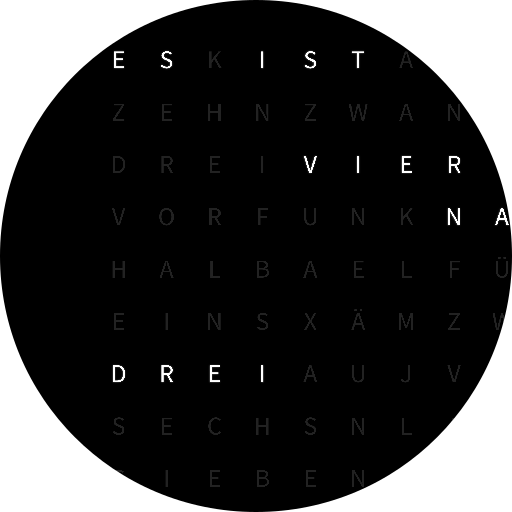
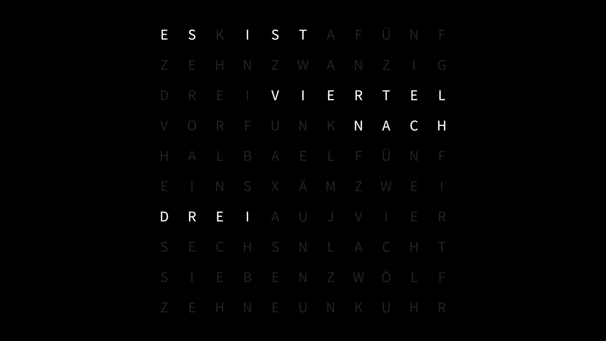

# German Word Clock Screensaver

A simple word clock screensaver in german for macOS. The time is rounded down so that `15:18` is displayed as `15:15` with the words `ES IST VIERTEL NACH DREI`.

## Installation

- Download the [latest version](https://github.com/Wandmalfarbe/german-word-clock-screensaver/releases/latest) of the screensaver from the releases page.
- Install the screensaver by double-clicking on the file with the extension `.saver`.

## Related

- [Simple Clock Screensaver](https://github.com/Wandmalfarbe/Simple-Clock-Screensaver) is an analogue clock screensaver for macOS written entirely in Swift. It has support for skins/themes (in source code only) and can be styled to match a wide variety of analogue wall clocks.

## Credits

- This screensaver is a fork of [grid clock screensaver by Christopher Newton](https://github.com/chrstphrknwtn/grid-clock-screensaver).

## License

This project is open source licensed under the BSD 3-Clause License. Please see the [LICENSE file](LICENSE) for more information.